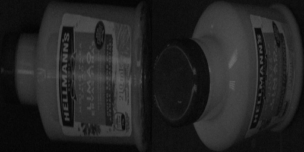
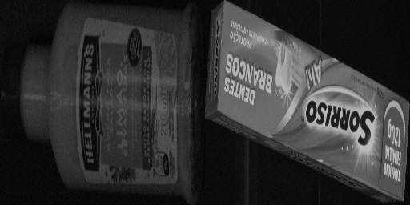
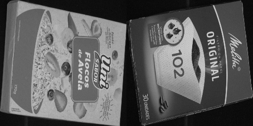
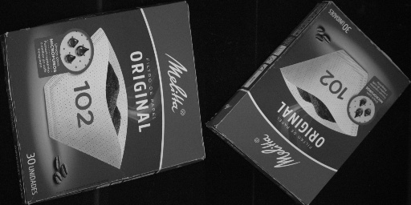

# Desafio técnico Infinity Vision

**Atenção:** Leia todo o READ ME antes de começar o desafio, ele contém dicas importantes que facilitarão a implementação das funcionalidades descritas, como que bibliotecas usar e como comparar duas imagens.

## Critérios de avaliação

#### Clareza do do código
- Nomes claros de variáveis e funções
- Respeito do princípio da responsabilidade única

#### Uso de boas práticas de programação
- Uso de princípios DRY, KISS e SOLID

#### Corretude
- Se a saída do programa é a esperada

#### Documentação
- Read me com instruções de uso do programa
- Registro de dependência necessárias para execução do programa
- Instruções de como utilizar o programa

## Desafio
### Descrição
Neste desafio, você irá criar um programa que compara duas imagens e determina se elas representam o mesmo produto de supermercado ou produtos diferentes.  

A primeira etapa será implementar a leitura de um arquivo de configuração que diz quais imagens serão comparadas e qual o valor limiar, também conhecido como threshold, que será utilizado para determinar se o produto é o mesmo ou não.  

Em seguida você terá de ler as imagens fornecidas e comparar o quão similar elas são e se a distância entre elas é menor que o limiar (threshold) fornecido para considerá-las do mesmo produto.  

Por fim, você precisará realizar duas ações: 
1. Imprimir no terminal a distância entre as imagens e se elas devem ser considerádas do mesmo produto ou não
2. Salvar em disco o resultado das transformações que você fez nas imagens antes de chegar nesse resultado.  

Abaixo você encontrará a especificação das entradas e saídas do programa e instruções explicando como implementar a funcionalidade descrita acima. As instruções te guiarão na implementação e dirão em alto nível cada um dos passos necessários para implementar o programa como um todo, incluindo como fazer a comparação entre as imagens e o critério usado para determinar se duas imagens pertencem ao mesmo produto. Caso alguma instrução não esteja clara ou surja alguma dúvida, fique a vontade para me contatar via email em caio.duran@myinfinityvision.com.br.  

**Boa sorte!**

### Especificação de entradas e saídas

#### Entradas esperadas

##### O seu programa deve receber as seguintes entradas:

- Caminho do arquivo de configuração YAML
- Arquivo YAML contendo caminho para as imagens A e B, caminho de saída da imagem concatenada e limiar (threshold) a ser usado na comparação de distância
- arquivos JPG das imagens A e B

##### Exemplo do yaml utilizado na entrada do programa

```yaml
image_a: produto_a.jpg
image_b: produto_b.jpg
output_location: concatenated_images.jpg
threshold: 0.5
```

#### Saídas esperadas

##### O seu programa deve apresentar as seguintes saídas:
- Print da distância entre as imagens A e B
- Print dizendo se os produtos são iguais ou diferentes
- Arquivo JPG com resultado da concatenação entre as imagens A e B, as imagens usadas na concatenação devem estar redimensionadas e em preto e branco (grayscale)

##### Exemplo da saída no terminal
```bash
distância: 0.7
Produtos diferentes
```

### Instruções de implementação

#### 1. Leitura de entradas
- Capturar caminho do arquivo yaml passado como argumento via linha de comando para o programa python
- Ler arquivo yaml presente no caminho fornecido  
**dica:** Use pyyaml para isso
- Validar tipo das entradas fornecidas no arquivo yaml (**dica:** Use pydantic para isso)
    - image_a deve ser uma string
    - image_b deve ser uma string
    - output_location deve ser uma string
    - threshold deve ser um float

- Carregar imagens A e B em memória utilizando os caminhos fornecidas no arquivo yaml

#### 2. Processamento de dados
- Transformar as imagens em preto e branco (grayscale)
- Redimensionar as imagens para 256x256, use as imagens em preto e branco
- Para cada imagem gerar uma lista ou array contendo contagem de quantas vezes cada valor de pixel aparece na imagem (histograma de pixels), use as imagens redimensionadas para isso  
**dica:** Em uma imagem em escala de cinza os pixels assumem valores entre 0 e 255
- Calcular distância angular (distância cosseno) entre a lista extraída da imagem A e a lista extraída da imagem B , atenção distância angular não é e mesma coisa que similaridade de cossenos 
**dica:** Use scipy para isso

#### 3. Apresentação de saídas
- Imprimir distância calculada
- Comparar distância obtida com o limiar (threshold) fornecido no arquivo YAML
- Imprimir "Mesmo produto" se a distância for menor que o limiar (threshold) fornecido e "Produtos diferentes" se a distância for maior ou igual ao limiar fornecido
- Concatenar imagens redimensionadas
- Salvar imagem gerada como resultado da concatenação no caminho fornecido no campo "output_location" do arquivo YAML

### Importante
#### Você deve utilizar as seguintes bibliotecas no seu programa:
- opencv-python
- pydantic

### Testando a sua implementação

Nesse repositório você vai encontrar arquivos de exemplo para você testar seu programa. Faça download desse repositório e copie as pastas *examples* e *produtos* para para a mesma pasta que seu programa.  
**Atenção:** Para facilitar a demonstração assumimos que seu programa se chama "solution.py".  

Após copiar os arquivos você poderá passar como argumento para o seu programa o caminho de um dos yaml na pasta *examples* e analizar se a saída de seu programa é igual a fornecida na tabela gabarito abaixo.  

#### Exemplo de chamada do programa
```bash
python solution.py examples/examples_1.yaml
```

#### Tabela gabarito

Argumento               | Saída no terminal                          | Imagem gerada
----------------------- | ------------------------------------------ | -------------------------------
examples/example_1.yaml | 0.26853975510498873<br>Mesmo produto       | 
examples/example_2.yaml | 0.3341991590475182<br>Produtos diferentes  | 
examples/example_3.yaml | 0.6731067771089819<br>Produtos diferentes  | 
examples/example_4.yaml | 0.22856307324787906<br>Mesmo produto       | 
examples/example_5.yaml | 0.22856307324787906<br>Produtos diferentes | 

### Sobre o uso de ferramentas de IA Generativa (como o ChatGPT):  
O uso dessas ferramentas é permitido nesse desafio, contudo **fique atento!**  
Um dos critérios de avaliação desse desafio é o uso de boas práticas de programação e essas ferramentas não costumam utilizá-las, tenha certeza de editar o código produzido por essas ferramentas manualmente para que siga essas práticas.  
**Entenda cada linha do código que está sendo entregue**, você precisará explicar algumas partes do código para o entrevistador após a entrega do desafio e será questionado sobre o que aconteceria caso algumas partes fossem mudadas, então evite desconfortos e entenda todos os passos até o resultado final. 

## Entrega

A entrega do desafio de ser feita no formato de um repositório no github, um link para o repositório deve ser enviado para o email caio.duran@myinfinityvision.com.br com o assunto "Desafio Infinity Vision", o corpo do email deve conter seu nome completo e o link para o repositório.